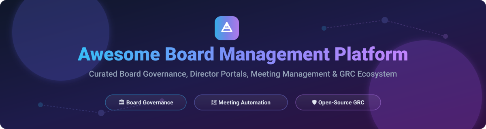

# 🏛️ Awesome Board Management Platform & Board Governance Ecosystem 📊

  

  
  
  
  
  

---

## 📌 Comprehensive Guide to Board Portals, Meeting Management & Governance Software

A curated directory of leading **SaaS board portals**, enterprise **governance software**, and self-hosted **open-source board management systems**. Designed for corporate secretaries, board directors, non-profit trustees, compliance officers, and legal teams seeking efficient meeting preparation, digital voting, and fiduciary oversight solutions.

---

## 📑 Table of Contents
- [🌐 SaaS / Commercial Board Portals](#-saas--commercial-board-portals)
- [🔓 Open-Source GitHub Projects](#-open-source-github-projects)
- [🛠️ How to Contribute](#️-how-to-contribute)
- [☕ Support & Sponsorship](#-support--sponsorship)
- [⚠️ Disclaimer](#%EF%B8%8F-disclaimer)
- [📈 Star History](#-star-history)

---

## 🌐 SaaS / Commercial Board Portals

> 📊 **Market Insights**: The global **Board Management Software / Board Portal Market** was valued at approximately **$2.9 Billion in 2025** and is projected to expand at a CAGR of **8.5%–9.3%**, reaching over **$6.5 Billion by 2035**. The sector is **moderately concentrated**, with established enterprise GRC giants holding significant market share while agile, SME-focused SaaS providers compete on ease-of-use and transparent flat-rate pricing.

| Platform | Key Governance Features | Starting Tier Pricing | Free Tier / Trial Limits | Company Size / Revenue / Valuation (Est.) |
| :--- | :--- | :--- | :--- | :--- |
| **[Diligent Boards](https://www.diligent.com/)** 💼 | Enterprise board packets, secure document distribution, voting, agendas, and AI-assisted governance workflows. | Custom Enterprise Quotes (~$15,000–$25,000/yr starting) | 30-Day Free Trial (GovernAI features only; no permanent free plan) | **~$500M - $1B ARR** (Acquired for ~$624M) |
| **[BoardPAC](https://www.boardpac.com/)** 🔒 | Secure meeting automation, iPad/tablet board app, confidential document sharing, and digital signature voting. | Custom Enterprise Quotes (Sales-led) | Demo / Free Trial upon request | **~$26.5M Annual Revenue** |
| **[Boardable](https://boardable.com/)** 🤝 | Non-profit board management, agenda builder, video conferencing, minutes maker, and goal tracking. | **$20.99 / user / month** (billed annually) | 14-Day Free Trial (No credit card required) | **~$2.0M Annual Revenue** ($12.5M total funding) |
| **[BoardPro](https://www.boardpro.com/)** ⚡ | Streamlined board meeting workflow, automated agendas, decision tracking, and board packet generation for SMEs. | **$1,650 / board / year** (Essentials plan) | 30-Day Free Trial (Full access, no credit card required) | Private SME SaaS (< $10M Revenue) |
| **[OnBoard](https://www.onboardmeetings.com/)** 📈 | Board intelligence platform, real-time collaboration, D&O questionnaires, voting, and secure messaging. | Custom Tiered Quotes (Sales-led) | Demo / Trial available upon consultation | Enterprise Private GRC Vendor |
| **[BoardEffect](https://www.boardeffect.com/)** 🏛️ | Governance software tailored for healthcare, higher education, and foundation boards with meeting scheduling. | Custom Quotes (Diligent Subsidiary) | Demo available upon request | Subsidiary of Diligent ($19M historical funding) |
| **[Convene](https://convene.com/)** 📅 | Secure board portal software, multi-platform annotation, paperless meeting management, and audit trails. | Custom Quote / Per user pricing | 14-Day Free Trial / Interactive Demo | Enterprise Security Vendor |
| **[Board Intelligence](https://www.boardintelligence.com/)** 🧠 | AI-powered board pack creation, management reporting, executive summaries, and decision tracking. | Custom Enterprise Pricing | Custom Demo / Pilot Program | Mid-Market Enterprise Vendor |
| **[Aprio](https://www.aprio.com/)** 🔐 | Secure document distribution, director portal, committee management, and board portal support. | Custom Flat-rate or Per-user quotes | Custom Demo / Trial upon request | Established Regional Board Provider |
| **[Digital Boardroom](https://www.digitalboardroom.com/)** 🖥️ | Board portal for meeting prep, collaborative note-taking, and secure governance workflows. | Custom Quotes | Demo upon request | Niche Commercial Vendor |

---

## 🔓 Open-Source GitHub Projects

These self-hosted repositories and frameworks offer transparent board operations, Governance, Risk & Compliance (GRC) engines, agile committee tools, and AI-native meeting automation.

| Repo & Link | Stars | Description & Key Features | License | Stack |
| :--- | :--- | :--- | :--- | :--- |
| **[mattermost-community/focalboard](https://github.com/mattermost-community/focalboard/stargazers)** 📌 |  | Open-source project board tool with Kanban, table, gallery, and calendar views for tracking committee action items. | AGPL-3.0 | Go, TypeScript, React |
| **[opf/openproject](https://github.com/opf/openproject/stargazers)** 📅 |  | Open-source management software with structured meeting module, agenda management, and meeting minutes tracking. | GPL-3.0 | Ruby on Rails, Angular |
| **[ParabolInc/parabol](https://github.com/ParabolInc/parabol/stargazers)** 💬 |  | Open-source meeting workspace for retrospectives, sprint planning, structured meeting facilitation, and decision capture. | Apache-2.0 | Node.js, GraphQL, Valkey |
| **[getprobo/probo](https://github.com/getprobo/probo/stargazers)** 🛡️ |  | Self-hostable GRC platform for risk tracking, audit logs, policy approvals, document sign-offs, and 270+ MCP AI tools. | ISC | TypeScript, Go, Docker |
| **[UnicisTech/unicis-platform-ce](https://github.com/UnicisTech/unicis-platform-ce/stargazers)** 🔐 |  | Governance, Risk & Compliance solution with ISO 27001/GDPR mapping, REST API, SOA management, and domain health checks. | Apache-2.0 | TypeScript, OpenAPI |
| **[vijeeshr/quickretro](https://github.com/vijeeshr/quickretro/stargazers)** ⚡ |  | Lightweight open-source web application for conducting remote retrospectives and committee brainstorming sessions. | AGPL-3.0 | JavaScript, Node.js |
| **[vibecode/easyboard](https://vibecode.law/showcase/easyboard-547268)** 🤖 | *N/A (Showcase)* | AI-native open-source board management platform. Classifies minutes, financial reports, voting workflows (quorum/majority), and audit trails. | Open Source | Replit, Claude, Web |
| **[frousselet/cairn](https://github.com/frousselet/cairn/stargazers)** 🇫🇷 |  | Self-hosted GRC platform covering ISO 27001, GDPR compliance, strategic context, management reviews, and bilingual AI assistance. | AGPL-3.0 | Django 5.2, PostgreSQL |
| **[juanfran/tapiz](https://github.com/juanfran/tapiz/stargazers)** 🎨 |  | Self-hosted web collaborative board with real-time sticky notes, freehand drawing, polling, estimations, and quick voting. | MIT | Angular, Fastify, TRPC |

---

## 🛠️ How to Contribute

Contributions are welcome! Follow these steps to submit additions or updates:

1. **Fork** this repository 🍴
2. **Create** a new branch (`git checkout -b add-new-board-tool`)
3. **Add** entries following the table format in `README.md`
4. **Ensure** links, pricing details, and repository star links are factual and updated
5. **Open** a Pull Request 🚀

---

## ☕ Support & Sponsorship

If you find this curated directory helpful for your organization, non-profit, or research:

- ⭐ **Star this repository** to help others discover it!
- 🔀 **Fork & Share** with governance professionals, corporate secretaries, and developers.
- 💖 **Sponsor the Maintainer**: Support ongoing updates via the [GitHub Sponsor Dashboard](https://github.com/sponsors/ishandutta2007).

---

## ⚠️ Disclaimer

- This is a **community-curated list** for informational and educational purposes only — not an endorsement of any vendor.
- Board portals process sensitive legal, financial, and fiduciary documents. Always implement enterprise access controls, multi-factor authentication, and security hardening for self-hosted instances.

---

## 📈 Star History

---

**Made with ❤️ for corporate secretaries, board directors, trustees, and governance innovators.**
